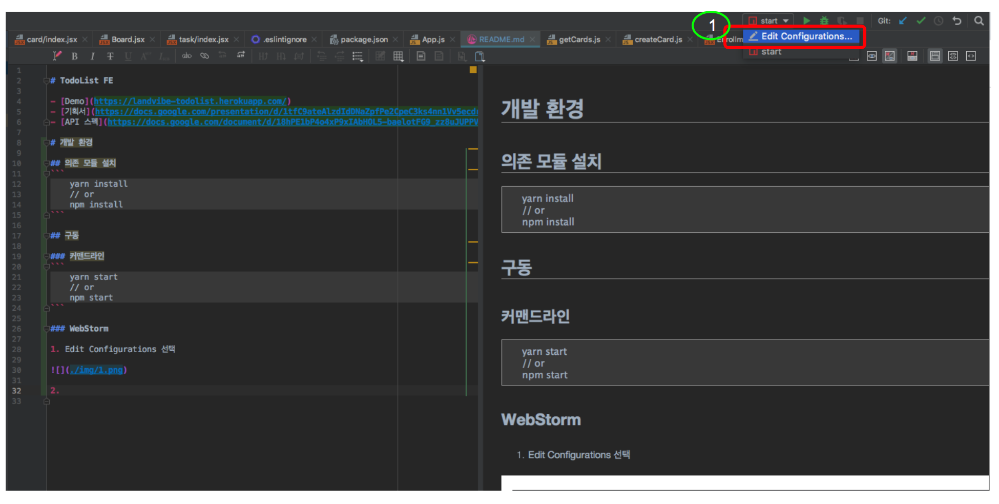
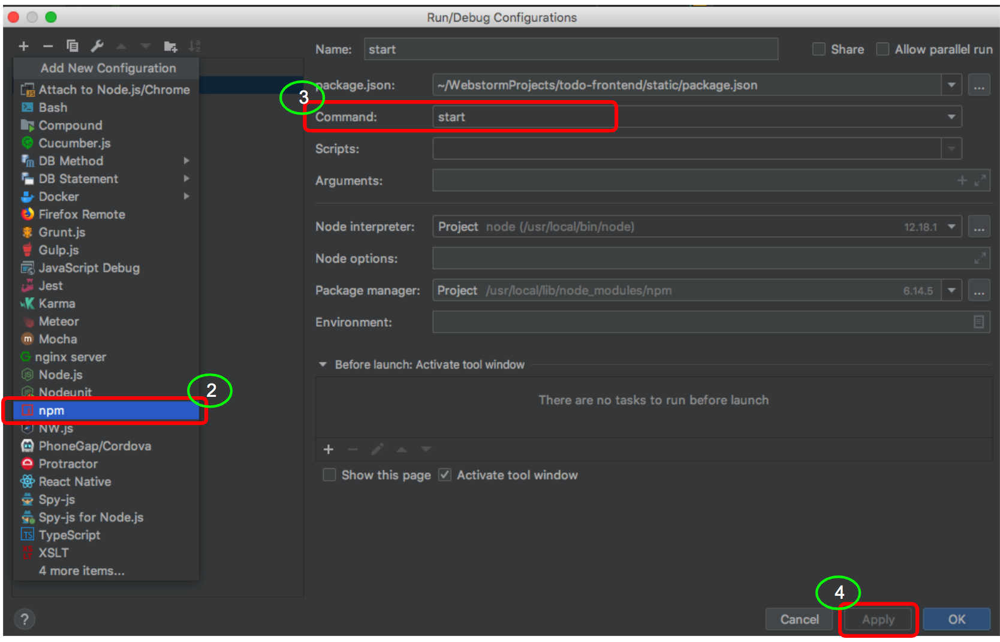
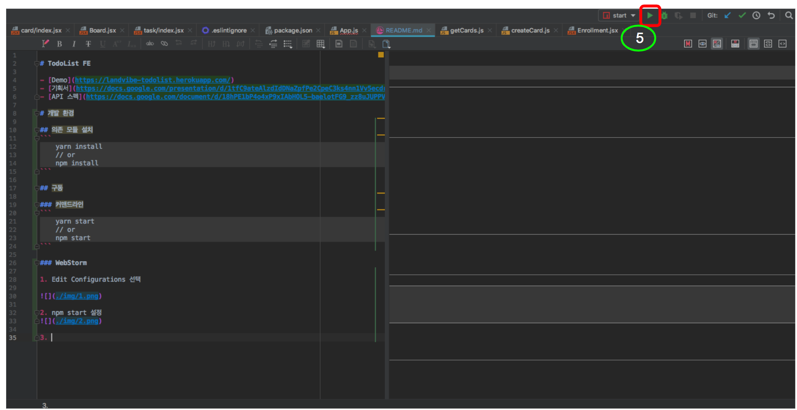

# TodoList FE

- [Demo](https://landvibe-todolist.herokuapp.com/)
- [기획서](https://docs.google.com/presentation/d/1tfC9ateAlzdIdDNaZpfPe2CpeC3ks4nn1Vv5ecdr1c4/edit#slide=id.g52fd51b95e_0_451)
- [API 스펙](https://docs.google.com/document/d/18hPE1bP4o4xP9xIAbHOL5-baelotFG9_zz8uJUPPVzw/edit)

# 개발 환경

## 의존 모듈 설치
```
    yarn install
    // or
    npm install
```

## 구동

### 커맨드라인
```
    yarn start
    // or
    npm start
```

### WebStorm

1. Edit Configurations 선택



2. npm start 설정



3. Run 'start'


